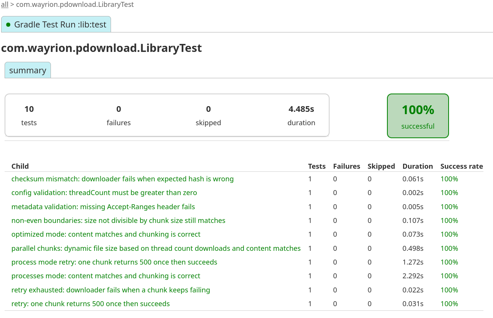
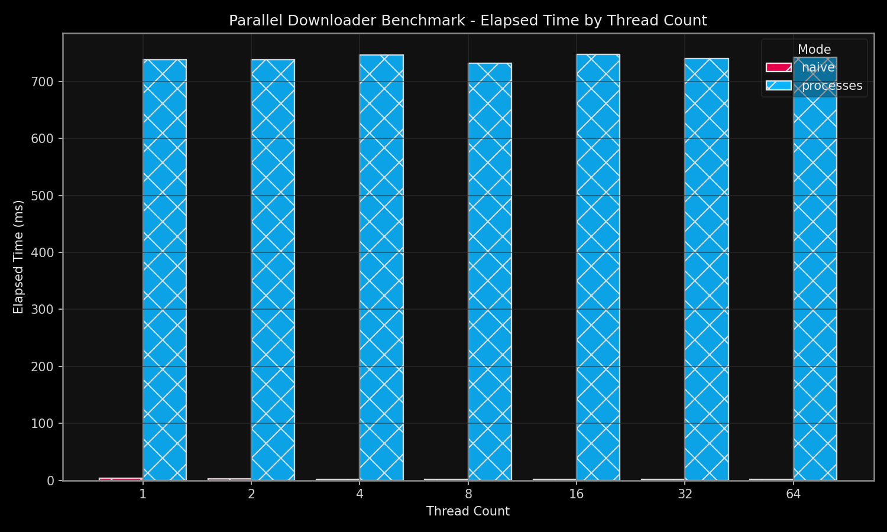
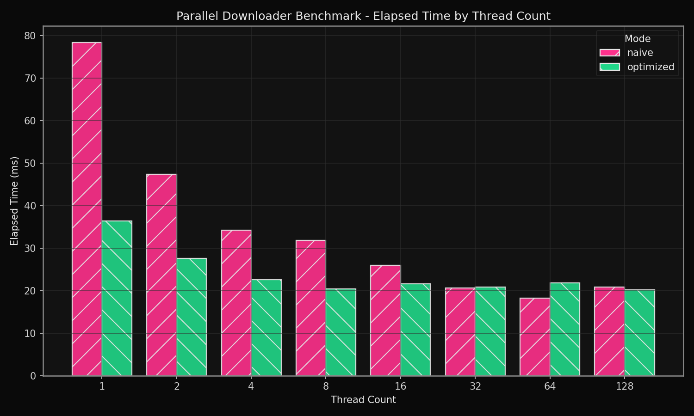
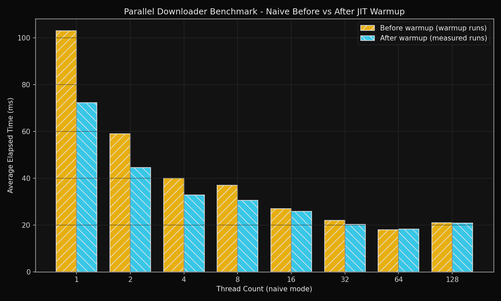

# Parallel Range Downloader (Kotlin)


This project implements a parallel chunk-based downloader using HTTP `Range` requests.
It includes:
- a local Apache Docker setup configured for HTTP/2 (`h2`/`h2c`),
- a downloader CLI (default `--threads 8`),
- benchmark CLI for powers-of-two thread counts,
- KoTest coverage for correctness and retries,
- a Python plotting script with a JetBrains-inspired theme.

## Code layout

Core Kotlin sources are under `lib/src/main/kotlin/com/wayrion/pdownload`:

 - [Library.kt](https://github.com/Wayrion/pdownload/blob/main/lib/src/main/kotlin/com/wayrion/pdownload/Library.kt): downloader core (`DownloadConfig`, metadata fetch, range splitting, thread/process download paths).
 
- [NaiveChunkWriter.kt](https://github.com/Wayrion/pdownload/blob/main/lib/src/main/kotlin/com/wayrion/pdownload/NaiveChunkWriter.kt) / [OptimizedChunkWriter.kt](https://github.com/Wayrion/pdownload/blob/main/lib/src/main/kotlin/com/wayrion/pdownload/OptimizedChunkWriter.kt): two thread based chunk write strategies.
- [ProcessChunkWorker.kt](https://github.com/Wayrion/pdownload/blob/main/lib/src/main/kotlin/com/wayrion/pdownload/ProcessChunkWorker.kt): child JVM worker used by `processes` mode.
- [ChunkHttp.kt](https://github.com/Wayrion/pdownload/blob/main/lib/src/main/kotlin/com/wayrion/pdownload/ChunkHttp.kt): shared chunk-range GET + retry helper logic.
- [DownloaderCli.kt](https://github.com/Wayrion/pdownload/blob/main/lib/src/main/kotlin/com/wayrion/pdownload/DownloaderCli.kt): user-facing downloader CLI entrypoint.
- [BenchmarkCli.kt](https://github.com/Wayrion/pdownload/blob/main/lib/src/main/kotlin/com/wayrion/pdownload/BenchmarkCli.kt): benchmark CLI entrypoint.
- [BenchmarkRunner.kt](https://github.com/Wayrion/pdownload/blob/main/lib/src/main/kotlin/com/wayrion/pdownload/BenchmarkRunner.kt): benchmark orchestration + option parsing.
- [BenchmarkModels.kt](https://github.com/Wayrion/pdownload/blob/main/lib/src/main/kotlin/com/wayrion/pdownload/BenchmarkModels.kt): benchmark report and row data models.
- [BenchmarkSummary.kt](https://github.com/Wayrion/pdownload/blob/main/lib/src/main/kotlin/com/wayrion/pdownload/BenchmarkSummary.kt): benchmark summary/statistics calculations.
- [BenchmarkJson.kt](https://github.com/Wayrion/pdownload/blob/main/lib/src/main/kotlin/com/wayrion/pdownload/BenchmarkJson.kt): benchmark JSON serialization.
- [CliArgs.kt](https://github.com/Wayrion/pdownload/blob/main/lib/src/main/kotlin/com/wayrion/pdownload/CliArgs.kt): shared CLI argument parsing and standardized CLI error helpers.

Tests are under [LibraryTest.kt](https://github.com/Wayrion/pdownload/blob/main/lib/src/test/kotlin/com/wayrion/pdownload/LibraryTest.kt).
Plotting lives in [scripts/plot_benchmark.py](https://github.com/Wayrion/pdownload/blob/main/scripts/plot_benchmark.py).

## 1) Local Apache HTTP server (Task 1)

Build image:

```bash
docker build -t pdownload-apache-h2 docker
```

Run with bundled sample file:

```bash
docker run --rm -d --name pdownload-httpd -p 8080:80 pdownload-apache-h2
```

Run against your own host directory:

```bash
docker run --rm -d --name pdownload-httpd -p 8080:80 \
	-v /path/to/your/local/directory:/usr/local/apache2/htdocs:ro \
	pdownload-apache-h2
```

Verify host accessibility + required headers:

```bash
curl -I http://127.0.0.1:8080/sample.txt
curl -i -H "Range: bytes=0-31" http://127.0.0.1:8080/sample.txt
```

Stop server:

```bash
docker stop pdownload-httpd
```

Docker Compose
---------------

You can use the included `docker-compose.yml` to manage the server. The compose project will stop/remove containers it created, rebuild the image, and start the container again. From the repository root:

```bash
# stop/remove containers created by compose, rebuild the image, and start detached
docker compose -f docker/docker-compose.yml down --remove-orphans
docker compose -f docker/docker-compose.yml build --no-cache
docker compose -f docker/docker-compose.yml up -d --force-recreate
```

Or as a single one-liner:

```bash
docker compose -f docker/docker-compose.yml down --remove-orphans && docker compose -f docker/docker-compose.yml build --no-cache && docker compose -f docker/docker-compose.yml up -d --force-recreate
```

The compose spec is in [docker-compose.yml](docker-compose.yml).

## 2) Downloader CLI (Task 2 + Task 4)

Run help:

```bash
./gradlew :lib:run --args="--help"
```

Download file with defaults (`8` threads, `naive` mode):

```bash
./gradlew :lib:run --args="--url http://127.0.0.1:8080/sample.txt --output build/download.bin"
```

Run optimized mode:

```bash
./gradlew :lib:run --args="--url http://127.0.0.1:8080/sample.txt --output build/download-opt.bin --mode optimized --threads 16"
```

`--mode` values:
- `naive`: buffered read/write chunk loop,
- `optimized`: `FileChannel.transferFrom` path,
- `processes`: per-chunk child JVM worker and merge.

## 3) Tests (Task 3)

Run unit tests:

```bash
./gradlew :lib:test
```

Latest observed run summary (`com.wayrion.pdownload.LibraryTest`):
- tests: `10`
- failures: `0`
- skipped: `0`
- success rate: `100%`
- duration: `4.485s`



HTML report path:
- `build/lib/reports/tests/test/classes/com.wayrion.pdownload.LibraryTest.html`

Covered scenarios include:
- parallel chunks with dynamic payload sizing (content + chunk count validation),
- non-even boundaries where file size is not divisible by chunk size,
- optimized mode correctness (content + chunk count validation),
- processes mode correctness (content + chunk count validation),
- retry success for thread mode when one chunk fails once,
- retry success for process mode when one chunk fails once,
- retry exhausted failure when a chunk keeps returning errors,
- checksum mismatch failure when expected SHA-256 is incorrect,
- metadata validation failure when `Accept-Ranges: bytes` is missing,
- config validation failure when invalid settings are provided (e.g. `threadCount=0`).


P.S. If you're SSH'd into a remote machine and want to view generated test reports in your browser, you can serve them quickly:

```bash
cd build/lib/reports/tests/test
python3 -m http.server 8765
```

Then tunnel locally and open in your browser:

```bash
ssh -L 8765:127.0.0.1:8765 <user>@<remote-host>
```

Open `http://127.0.0.1:8765` locally.

## 4) Benchmark matrix + JSON output

Run benchmark help:

```bash
./gradlew :lib:runBenchmark --args="--help"
```

Run required thread powers (`1,2,4,8,16,32,64`) across all modes:

```bash
./gradlew :lib:runBenchmark --args="--url http://127.0.0.1:8080/sample.txt --mode both --threads 1,2,4,8,16,32,64 --output-json build/benchmark-compare.json"
```

By default, each mode/thread pair runs `5` warm-up iterations (stored under `warmups`) before measured iterations (stored under `runs`).
Override warm-up count when needed:

```bash
./gradlew :lib:runBenchmark --args="--url http://127.0.0.1:8080/sample.txt --mode both --threads 1,2,4,8,16,32,64 --warmup-iterations 8 --output-json build/benchmark-compare.json"
```

This writes run-level and summary metrics to JSON (`schemaVersion`, target metadata, host info, per-run elapsed time, and per-mode best thread count).

## 5) Plot benchmark results (Task 5)

Render plots with `uv` (recommended):

```bash
uv run scripts/plot_benchmark.py --input build/benchmark-compare.json --output-dir build/benchmark-plots
```

Use high-contrast colors when needed:

```bash
uv run scripts/plot_benchmark.py --input build/benchmark-compare.json --output-dir build/benchmark-plots --palette high-contrast
```

Alternative (venv + pip) setup:

```bash
python3 -m venv .venv
source .venv/bin/activate
python -m pip install -U pip
python -m pip install matplotlib
python scripts/plot_benchmark.py --input build/benchmark-compare.json --output-dir build/benchmark-plots
```

Generated charts include:
- `elapsed_by_threads.png`
- `jit_warmup_before_after.png`

### Benchmark screenshots

- [Elapsed by threads](screenshots/elapsed_by_threads.png)
- [Naive warmup before vs after](screenshots/jit_warmup_before_after.png)
- [Processes mode elapsed by threads](screenshots/elapsed_by_processes.png)

Note: It was expected that thread-based parallelism would outperform process-based parallelism due to lower coordination overhead and no process-level isolation costs. This scenario was benchmarked explicitly, and the hypothesis was confirmed, as shown in the graph below.


This was done on a very small sample file (64KB) as the benchmark was taking too long for larger files which included multiple iterations for warmup and to account for run to run variance. However, it is obvious that the thread based parallelism approach is superior. Furthermore, the benchmark is limited to 8 processes in a real world it would realisticly be tied to the number of processors available and 8 is enough to demonstrate the mis-use of processes in this use-case. 




With 3 JIT warmup iterations on 1MB file. 



Run with 3 JIT warmup iterations on a 1MB file with the naive implementation.

## Benchmark limitations

These benchmark results are useful for directional comparison, but they are not a fully controlled performance lab measurement.

- **JIT/GC effects are not isolated:** warmup and measured phases include JVM compilation and garbage-collection behavior, and there is no explicit GC/JIT instrumentation in the report.
- **OS state is not controlled:** CPU frequency scaling, thermal throttling, scheduler decisions, background services, and interrupt noise can affect timings. While, this benchmark was run on Oracle cloud infrasture which ensures that the CPU is fixed at a specific frequence and there is no throttling, other factors are not accounted for.

- **Filesystem/page cache effects are not controlled:** repeated downloads can benefit from kernel page cache and filesystem cache behavior, changing later-run latency.

- **Network stack variability is not controlled:** even on localhost/docker, TCP buffering, socket scheduling, and container/host networking overhead introduce variance.

- **Single-host/single-environment bias:** results reflect one machine/runtime configuration and should not be generalized without rerunning on the target environment.

- **No statistical confidence intervals:** the JSON summary reports means and success rates, but does not compute variance, percentiles, confidence intervals, or significance tests.

Lastly, I'm a human at the end of the day and its totally possible I have missed something or mis-represented data and values. In that case please feel free to open an issue.

Interpret the plots primarily as comparative trends under this setup, not as universal absolute throughput/latency guarantees.

## CLI flags that can improve performance

Useful tuning flags for experiments:
- `--threads`: increase parallelism until network/disk saturates or the overhead from switching threads hurts performance. From testing, 8 seems like the best overall thread count.
- `--chunk-size-bytes`: reduce request overhead with larger chunks; too large can underutilize threads.
- `--io-buffer-bytes`: increase per-thread buffering to reduce syscall pressure.
- `--mode optimized`: usually lower copy overhead versus naive mode but sometimes can be slightly worse.
- `--max-retries` + `--retry-delay-ms`: improve stability on flaky links without over-retrying.
- `--connect-timeout-ms` and `--request-timeout-ms`: avoid hangs and improve benchmark consistency.

## Future scope: JVM runtime tuning

The downloader and benchmark are currently focused on algorithmic/runtime-structure choices (naive vs optimized vs processes). A strong next step is JVM-level tuning, because GC behavior and JIT policy can materially affect latency stability and throughput in I/O-heavy workloads.

Possible future experiments:
- compare GC policies with fixed benchmark settings (e.g., G1 vs ZGC vs Shenandoah where available),
- tune heap sizing and pause goals to reduce stop-the-world impact (for example `-Xms/-Xmx` and collector-specific pause targets),
- compare JDK distributions under the same benchmark matrix (same machine, same file, same thread counts),
- profile long benchmark runs to detect GC/compilation outliers and tail-latency spikes.

Behavior notes across JVMs on a high level:
- **HotSpot-based JDKs** (Temurin, Zulu, etc.) share core VM architecture, but may differ in packaging defaults, patch cadence, and collector availability by version.
- **JetBrains Runtime (JBR)** can be a useful evaluation target for Kotlin-centric toolchains/workloads; while not guaranteed to be faster for this CLI benchmark, it may provide practical wins in some environments and is worth measuring with the same benchmark matrix.
- **G1** is a good general-purpose default; it balances throughput and pause time but can still show pauses under allocation pressure.
- **Low-pause collectors** like ZGC/Shenandoah are designed for shorter pauses, often at some throughput or footprint trade-off depending on workload.
- **Azul Prime** is designed around low-latency runtime techniques and is worth evaluating when pause-time consistency is a hard requirement. This was not tested as I don't have a license and I believe you need to contact their sales team to get a a copy of the Zing/Azul JVM build.

Practical note: even if you stay on a standard HotSpot distribution, enterprise/runtime tuning guidance from vendors like Azul can still be used to derive actionable settings (heap sizing, pause targets, collector selection, warmup strategy) for this downloader benchmark.

Reference context for this direction:
- Kotlin + Azul collaboration note: https://blog.jetbrains.com/kotlin/2025/05/kotlin-and-azul-collaboration-for-enhanced-runtime-performance/

In short: thread-based parallelism is a strong baseline here, and JVM/GC tuning is a complementary layer that can further improve consistency and tail behavior.


Additional notes:
The files generated by [generate_text.py](https://github.com/Wayrion/pdownload/blob/main/scripts/generate_text.py) may not precisely match the file size that's input into the function. 